# 🏗️ Microservices Architecture - Complete Visual Guide

## 📋 Table of Contents

1. [System Overview](#system-overview)
2. [Kubernetes Deployment Architecture](#kubernetes-deployment-architecture)
3. [Request Flow Diagrams](#request-flow-diagrams)
4. [Database Architecture](#database-architecture)
5. [Authentication Flow](#authentication-flow)
6. [Chat Flow](#chat-flow)
7. [Deployment Environments](#deployment-environments)

---

## 🌐 System Overview

### High-Level Architecture

```mermaid
graph TB
    subgraph "Client Layer"
        User[👤 User Browser/App]
    end
    
    subgraph "Kubernetes Cluster - k3d"
        Ingress[🌐 NGINX Ingress<br/>api.local:8888]
        Gateway[🚪 Gateway Service<br/>Port 4000]
        Auth[🔐 Auth Service<br/>Port 4003]
        UserSvc[👥 User Service<br/>Port 4001]
        Chat[💬 Chat Service<br/>Port 4002]
    end
    
    subgraph "Infrastructure Layer - Docker Containers"
        MySQL[(🗄️ MySQL<br/>Auth DB<br/>Port 18006)]
        Postgres[(🗄️ PostgreSQL<br/>User DB<br/>Port 18005)]
        Mongo[(🗄️ MongoDB<br/>Chat DB<br/>Port 18004)]
        Redis[⚡ Redis<br/>Cache<br/>Port 18003]
        RabbitMQ[🐰 RabbitMQ<br/>Message Queue<br/>Port 18001]
    end
    
    User -->|http://api.local:8888| Ingress
    Ingress -->|Route all traffic| Gateway
    Gateway -->|Internal| Auth
    Gateway -->|Internal| UserSvc
    Gateway -->|Internal| Chat
    
    Auth -->|172.19.0.1:18006| MySQL
    UserSvc -->|172.19.0.1:18005| Postgres
    Chat -->|172.19.0.1:18004| Mongo
    
    Auth -.->|Cache| Redis
    UserSvc -.->|Cache| Redis
    Chat -.->|Events| RabbitMQ
    
    style User fill:#e1f5ff
    style Gateway fill:#fff4e6
    style Auth fill:#ffe6e6
    style UserSvc fill:#e6f7ff
    style Chat fill:#f0e6ff
```

---

## ☸️ Kubernetes Deployment Architecture

### K3d Cluster Setup

```mermaid
graph TB
    subgraph "Host Machine - Windows"
        Browser[🌐 Browser<br/>api.local:8888]
    end
    
    subgraph "k3d LoadBalancer"
        LB[⚖️ k3d-serverlb<br/>Port 8888 → 80]
    end
    
    subgraph "Ingress Layer"
        IngressCtrl[🌐 NGINX Ingress Controller<br/>LoadBalancer: 172.19.0.5:80]
    end
    
    subgraph "k3d Cluster - 3 Nodes"
        subgraph "Control Plane"
            Master[🎛️ k3d-chatapp-dev-server-0<br/>Control Plane + Worker]
            ChatPod[💬 chat-service<br/>IP: 10.42.2.9]
        end
        
        subgraph "Worker Node 1"
            Agent0[⚙️ k3d-chatapp-dev-agent-0]
            UserPod[👥 user-service<br/>IP: 10.42.0.7]
            GatewayPod[🚪 gateway-service<br/>IP: 10.42.0.8]
        end
        
        subgraph "Worker Node 2"
            Agent1[⚙️ k3d-chatapp-dev-agent-1]
            AuthPod[🔐 auth-service<br/>IP: 10.42.1.7]
        end
    end
    
    subgraph "K8s Services - Internal DNS"
        GatewaySvc[gateway-service<br/>ClusterIP 10.43.55.115]
        AuthSvc[auth-service<br/>ClusterIP 10.43.121.154]
        UserSvcK8s[user-service<br/>ClusterIP 10.43.143.222]
        ChatSvc[chat-service<br/>ClusterIP 10.43.225.124]
    end
    
    Browser -->|:8888| LB
    LB -->|:80| IngressCtrl
    IngressCtrl -->|Route: /| GatewaySvc
    GatewaySvc -->|:4000| GatewayPod
    GatewayPod -->|http://auth-service:4003| AuthSvc
    GatewayPod -->|http://user-service:4001| UserSvcK8s
    GatewayPod -->|http://chat-service:4002| ChatSvc
    
    AuthSvc --> AuthPod
    UserSvcK8s --> UserPod
    ChatSvc --> ChatPod
    
    style Browser fill:#e1f5ff
    style Master fill:#fff4e6
    style Agent0 fill:#e6f7ff
    style Agent1 fill:#f0e6ff
```

---

## 🔄 Request Flow Diagrams

### 1. User Registration Flow

```mermaid
sequenceDiagram
    participant User as 👤 User
    participant Browser as 🌐 Browser
    participant Ingress as 🌐 Ingress<br/>(api.local:8888)
    participant Gateway as 🚪 Gateway<br/>(K8s Pod)
    participant Auth as 🔐 Auth Service<br/>(K8s Pod)
    participant MySQL as 🗄️ MySQL<br/>(Docker)
    participant UserSvc as 👥 User Service<br/>(K8s Pod)
    participant Postgres as 🗄️ PostgreSQL<br/>(Docker)
    
    User->>Browser: Enter email, password, name
    Browser->>Ingress: POST /auth/register<br/>{email, password, displayName}
    Ingress->>Gateway: Route to gateway-service
    Gateway->>Auth: POST /register<br/>+ X-Internal-Token
    
    Auth->>MySQL: Check if email exists
    MySQL-->>Auth: Email available
    
    Auth->>MySQL: INSERT user_credentials<br/>(hashed password)
    MySQL-->>Auth: User created (userId)
    
    Auth->>UserSvc: POST /users<br/>{userId, email, displayName}
    UserSvc->>Postgres: INSERT users
    Postgres-->>UserSvc: User profile created
    UserSvc-->>Auth: Success
    
    Auth->>MySQL: INSERT refresh_token
    MySQL-->>Auth: Token stored
    
    Auth-->>Gateway: {accessToken, refreshToken}
    Gateway-->>Ingress: 201 Created<br/>{accessToken, refreshToken}
    Ingress-->>Browser: Response
    Browser-->>User: ✅ Registration successful!
    
    Note over Auth,MySQL: Password hashed with bcrypt
    Note over Auth: JWT signed with secret
```

### 2. User Login Flow

```mermaid
sequenceDiagram
    participant User as 👤 User
    participant Browser as 🌐 Browser
    participant Ingress as 🌐 Ingress
    participant Gateway as 🚪 Gateway
    participant Auth as 🔐 Auth Service
    participant MySQL as 🗄️ MySQL
    participant Redis as ⚡ Redis
    
    User->>Browser: Enter email & password
    Browser->>Ingress: POST /auth/login<br/>{email, password}
    Ingress->>Gateway: Route to gateway
    Gateway->>Auth: POST /login<br/>+ X-Internal-Token
    
    Auth->>Redis: Check cache for user
    Redis-->>Auth: Cache miss
    
    Auth->>MySQL: SELECT * FROM user_credentials<br/>WHERE email = ?
    MySQL-->>Auth: User credentials
    
    Auth->>Auth: Verify password<br/>(bcrypt.compare)
    
    alt Password Valid
        Auth->>Auth: Generate JWT tokens
        Auth->>MySQL: INSERT refresh_token
        MySQL-->>Auth: Token stored
        Auth->>Redis: Cache user data (TTL: 1h)
        Auth-->>Gateway: {accessToken, refreshToken}
        Gateway-->>Ingress: 200 OK
        Ingress-->>Browser: Response
        Browser-->>User: ✅ Login successful!
    else Password Invalid
        Auth-->>Gateway: 401 Unauthorized
        Gateway-->>Ingress: 401 Unauthorized
        Ingress-->>Browser: Response
        Browser-->>User: ❌ Invalid credentials
    end
```

### 3. User Search Flow

```mermaid
sequenceDiagram
    participant User as 👤 Alice
    participant Browser as 🌐 Browser
    participant Ingress as 🌐 Ingress
    participant Gateway as 🚪 Gateway
    participant UserSvc as 👥 User Service
    participant Postgres as 🗄️ PostgreSQL
    participant Redis as ⚡ Redis
    
    User->>Browser: Search for "Bob"
    Browser->>Ingress: GET /users/search?query=bob<br/>Authorization: Bearer <token>
    Ingress->>Gateway: Route to gateway
    
    Gateway->>Gateway: Verify JWT token
    Gateway->>UserSvc: GET /search?query=bob<br/>X-User-Id: alice-id<br/>+ X-Internal-Token
    
    UserSvc->>Redis: Check cache: search:bob
    Redis-->>UserSvc: Cache miss
    
    UserSvc->>Postgres: SELECT * FROM users<br/>WHERE display_name ILIKE '%bob%'<br/>OR email ILIKE '%bob%'
    Postgres-->>UserSvc: [Bob's profile]
    
    UserSvc->>Redis: Cache result (TTL: 5m)
    UserSvc-->>Gateway: {data: [users]}
    Gateway-->>Ingress: 200 OK
    Ingress-->>Browser: Response
    Browser-->>User: 📋 Show Bob's profile
```

### 4. Create Conversation & Send Message Flow

```mermaid
sequenceDiagram
    participant Alice as 👤 Alice
    participant Browser as 🌐 Browser
    participant Ingress as 🌐 Ingress
    participant Gateway as 🚪 Gateway
    participant Chat as 💬 Chat Service
    participant Mongo as 🗄️ MongoDB
    participant RabbitMQ as 🐰 RabbitMQ
    participant UserSvc as 👥 User Service
    
    Alice->>Browser: Start chat with Bob
    Browser->>Ingress: POST /conversations<br/>{participantIds: [bob-id]}
    Ingress->>Gateway: Route to gateway
    Gateway->>Chat: POST /conversations<br/>+ X-Internal-Token
    
    Chat->>Mongo: db.conversations.insertOne({<br/>  participants: [alice-id, bob-id],<br/>  createdAt: now<br/>})
    Mongo-->>Chat: {conversationId}
    
    Chat->>RabbitMQ: Publish: conversation.created
    Chat-->>Gateway: {id, participants}
    Gateway-->>Ingress: 201 Created
    Ingress-->>Browser: Response
    
    Browser-->>Alice: 💬 Conversation created
    
    Note over Alice,Browser: Alice sends message
    
    Alice->>Browser: Type: "Hello Bob!"
    Browser->>Ingress: POST /conversations/{id}/messages<br/>{body: "Hello Bob!"}
    Ingress->>Gateway: Route to gateway
    Gateway->>Chat: POST /messages<br/>+ X-Internal-Token
    
    Chat->>Mongo: db.messages.insertOne({<br/>  conversationId,<br/>  senderId: alice-id,<br/>  body: "Hello Bob!",<br/>  createdAt: now<br/>})
    Mongo-->>Chat: {messageId}
    
    Chat->>RabbitMQ: Publish: message.sent<br/>{to: bob-id, from: alice-id}
    Chat-->>Gateway: {id, body, senderId}
    Gateway-->>Ingress: 201 Created
    Ingress-->>Browser: Response
    Browser-->>Alice: ✅ Message sent!
    
    Note over RabbitMQ: Bob's client listens to queue
    RabbitMQ-->>Browser: 🔔 New message notification
```

---

## 🗄️ Database Architecture

### Database Schema Overview

### Database Distribution

---

## 🔐 Authentication Flow (Detailed)

### JWT Token Flow

---

## 🌍 Deployment Environments

### Three Environment Setup

```mermaid
graph TB
    subgraph "Development - localhost:18100"
        DevGit[📝 Git Push to dev branch]
        DevBuild[🔨 Build Docker Images]
        DevDeploy[☸️ Deploy to dev namespace]
        DevTest[🧪 Run Tests]
    end
    
    subgraph "Staging - localhost:18200"
        StageMerge[🔀 Merge to staging branch]
        StageBuild[🔨 Build Docker Images]
        StageDeploy[☸️ Deploy to staging namespace]
        StageTest[🧪 Integration Tests]
        StageApproval[✅ QA Approval]
    end
    
    subgraph "Production - localhost:18300"
        ProdMerge[🔀 Merge to main branch]
        ProdBuild[🔨 Build Docker Images]
        ProdDeploy[☸️ Deploy to prod namespace]
        ProdMonitor[📊 Monitor Metrics]
        ProdRollback[⏮️ Rollback if Issues]
    end
    
    DevGit --> DevBuild
    DevBuild --> DevDeploy
    DevDeploy --> DevTest
    DevTest -->|Pass| StageMerge
    
    StageMerge --> StageBuild
    StageBuild --> StageDeploy
    StageDeploy --> StageTest
    StageTest --> StageApproval
    StageApproval -->|Approved| ProdMerge
    
    ProdMerge --> ProdBuild
    ProdBuild --> ProdDeploy
    ProdDeploy --> ProdMonitor
    ProdMonitor -->|Issues| ProdRollback
    
    style DevTest fill:#e6ffe6
    style StageApproval fill:#fff4e6
    style ProdMonitor fill:#ffe6e6
```

### Environment Configuration

---

## 🔄 Complete Request Lifecycle

### From Browser to Database and Back

---

## 📊 Network Architecture

### Port Mapping & Network Flow

---

## 🚀 Deployment Pipeline (Future)

### CI/CD Flow with GitHub Actions

```mermaid
graph TB
    subgraph "Developer Workflow"
        Dev[👨‍💻 Developer]
        Code[📝 Write Code]
        Commit[💾 Git Commit]
        Push[⬆️ Git Push]
    end
    
    subgraph "GitHub Actions CI/CD"
        Trigger[🎯 Workflow Triggered]
        Lint[🔍 Lint Code]
        Test[🧪 Run Tests]
        Build[🔨 Build Docker Images]
        Push2[📦 Push to Registry]
        Deploy[☸️ Deploy to K8s]
    end
    
    subgraph "Kubernetes Cluster"
        Apply[📋 Apply Manifests]
        RollingUpdate[🔄 Rolling Update]
        HealthCheck[❤️ Health Checks]
        Ready[✅ Deployment Ready]
    end
    
    subgraph "Monitoring"
        Prometheus[📊 Prometheus]
        Grafana[📈 Grafana]
        Alerts[🚨 Alerts]
    end
    
    Dev --> Code
    Code --> Commit
    Commit --> Push
    Push --> Trigger
    
    Trigger --> Lint
    Lint --> Test
    Test --> Build
    Build --> Push2
    Push2 --> Deploy
    
    Deploy --> Apply
    Apply --> RollingUpdate
    RollingUpdate --> HealthCheck
    HealthCheck --> Ready
    
    Ready --> Prometheus
    Prometheus --> Grafana
    Grafana --> Alerts
    
    style Test fill:#e6ffe6
    style Build fill:#fff4e6
    style Ready fill:#e6f7ff
    style Alerts fill:#ffe6e6
```

---

## 📈 Scaling Architecture (Future)

### Horizontal Pod Autoscaling

```mermaid
graph TB
    subgraph "Normal Load"
        User1[👤 Users: 100]
        Gateway1[Gateway: 1 pod]
        Auth1[Auth: 1 pod]
        User1Svc[User: 1 pod]
        Chat1[Chat: 1 pod]
    end
    
    subgraph "High Load Detection"
        Metrics[📊 Metrics Server]
        HPA[🎯 HPA Controller]
        Decision[CPU > 70%<br/>Scale Up!]
    end
    
    subgraph "Scaled State"
        User2[👤 Users: 1000]
        Gateway2[Gateway: 3 pods]
        Auth2[Auth: 5 pods]
        User2Svc[User: 3 pods]
        Chat2[Chat: 4 pods]
        LB[⚖️ Load Balancer]
    end
    
    User1 --> Gateway1
    Gateway1 --> Auth1
    Gateway1 --> User1Svc
    Gateway1 --> Chat1
    
    Auth1 --> Metrics
    Metrics --> HPA
    HPA --> Decision
    
    Decision --> Gateway2
    User2 --> LB
    LB --> Gateway2
    Gateway2 --> Auth2
    Gateway2 --> User2Svc
    Gateway2 --> Chat2
    
    style Decision fill:#fff4e6
    style LB fill:#e6f7ff
```

---

## 🔒 Security Architecture

### Security Layers

```mermaid
graph TB
    subgraph "External Layer"
        Internet[🌐 Internet]
        Firewall[🔥 Firewall]
        RateLimit[⏱️ Rate Limiting]
    end
    
    subgraph "Gateway Layer"
        Gateway[🚪 Gateway]
        JWTVerify[🔐 JWT Verification]
        CORS[🔒 CORS Policy]
        Helmet[🛡️ Security Headers]
    end
    
    subgraph "Service Layer"
        Auth[🔐 Auth Service]
        User[👥 User Service]
        Chat[💬 Chat Service]
        InternalToken[🎫 Internal API Token]
    end
    
    subgraph "Data Layer"
        Encryption[🔐 Encryption at Rest]
        MySQL[🗄️ MySQL]
        Postgres[🗄️ PostgreSQL]
        Mongo[🗄️ MongoDB]
        Backup[💾 Encrypted Backups]
    end
    
    Internet --> Firewall
    Firewall --> RateLimit
    RateLimit --> Gateway
    
    Gateway --> JWTVerify
    Gateway --> CORS
    Gateway --> Helmet
    
    JWTVerify --> Auth
    JWTVerify --> User
    JWTVerify --> Chat
    
    Auth --> InternalToken
    User --> InternalToken
    Chat --> InternalToken
    
    InternalToken --> Encryption
    Encryption --> MySQL
    Encryption --> Postgres
    Encryption --> Mongo
    Encryption --> Backup
    
    style Firewall fill:#ffe6e6
    style JWTVerify fill:#fff4e6
    style Encryption fill:#e6ffe6
```

---

## 📊 Technology Stack

### Complete Stack Overview

```mermaid
graph TB
    subgraph "Frontend (Future)"
        React[⚛️ React/Next.js]
        TypeScript[📘 TypeScript]
        TailwindCSS[🎨 Tailwind CSS]
    end
    
    subgraph "API Gateway"
        Express[🚪 Express.js]
        Helmet2[🛡️ Helmet]
        CORS2[🔒 CORS]
        Morgan[📝 Morgan Logger]
    end
    
    subgraph "Microservices"
        Node[🟢 Node.js 22]
        TS[📘 TypeScript]
        Zod[✅ Zod Validation]
        Pino[📋 Pino Logger]
    end
    
    subgraph "Databases"
        MySQL2[🗄️ MySQL 8.0]
        Postgres2[🗄️ PostgreSQL 16]
        Mongo2[🗄️ MongoDB 7]
    end
    
    subgraph "Caching & Messaging"
        Redis2[⚡ Redis 7]
        RabbitMQ2[🐰 RabbitMQ 3]
    end
    
    subgraph "Container Orchestration"
        Docker[🐳 Docker]
        K3d[☸️ k3d]
        Kubernetes[☸️ Kubernetes 1.27]
    end
    
    subgraph "Build & Deploy"
        pnpm[📦 pnpm]
        Dockerfile[🐳 Multi-stage Builds]
        GitHub[🐙 GitHub Actions]
    end
    
    React --> Express
    Express --> Node
    Node --> MySQL2
    Node --> Postgres2
    Node --> Mongo2
    Node --> Redis2
    Node --> RabbitMQ2
    
    Dockerfile --> Docker
    Docker --> K3d
    K3d --> Kubernetes
    
    style Node fill:#e6ffe6
    style Kubernetes fill:#e6f7ff
    style Docker fill:#e1f5ff
```

---

## 📝 Key Metrics & Performance

### Current Deployment Stats

| Metric | Value |
|--------|-------|
| **Cluster Nodes** | 3 (1 control-plane + 2 workers) |
| **Total Pods** | 4 (gateway, auth, user, chat) |
| **Services** | 4 (1 NodePort + 3 ClusterIP) |
| **Databases** | 3 (MySQL, PostgreSQL, MongoDB) |
| **Cache/Queue** | 2 (Redis, RabbitMQ) |
| **Total Containers** | 9 (4 K8s + 5 infrastructure) |
| **Memory Usage** | ~167 Mi (across all pods) |
| **CPU Usage** | ~6m (minimal load) |
| **Gateway Port** | api.local:8888 (via Ingress) |
| **Response Time** | ~50-100ms average |

### Resource Allocation

---

## 🎯 What's Next?

### Planned Enhancements

1. **CI/CD Pipeline** - GitHub Actions for automated deployment
2. **Monitoring** - Prometheus + Grafana dashboards
3. **Logging** - Centralized logging with Loki
4. ~~**Ingress**~~ - ✅ **NGINX Ingress Controller deployed** (api.local:8888)
5. **GitOps** - ArgoCD for declarative deployments
6. **Autoscaling** - HPA for automatic pod scaling
7. **Service Mesh** - Linkerd for advanced traffic management
8. **Secrets Management** - Sealed Secrets for secure secret storage

---

## 📚 Related Documentation

- [K8S Deployment Setup Guide](./K8S-DEPLOYMENT-SETUP.md)
- [Ingress Setup Guide](./INGRESS-SETUP-GUIDE.md)
- [Docker Compose Usage](./DOCKER-COMPOSE-USAGE.md)
- [Environment Setup Guide](./ENV-SETUP-GUIDE.md)
- [Port Configuration](./PORT-CONFIGURATION.md)
- [Deployment Guide](./DEPLOYMENT-GUIDE.md)

---

**Built with ❤️ using Node.js, TypeScript, Kubernetes, and Docker**
